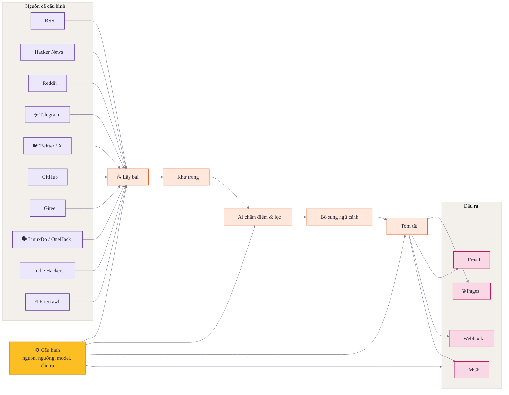

<div align="center">

# 🌅 Horizon

**Tận hưởng tin tức. Phần còn lại để Horizon lo**

[](LICENSE)
[](https://github.com/astral-sh/uv)
[](https://thysrael.github.io/Horizon/)
[](https://github.com/Thysrael/Horizon/commits/main)
[](http://makeapullrequest.com)

<a href="https://hellogithub.com/repository/Thysrael/Horizon" target="_blank"></a>
<br>


📡 Radar tin tức cá nhân chạy bằng AI. Tạo bản tin hàng ngày bằng tiếng Anh, Trung & Việt. | Xây dựng radar tin tức AI của riêng bạn

[📖 Demo trực tiếp](https://thysrael.github.io/Horizon/) · [📋 Hướng dẫn cấu hình](https://thysrael.github.io/Horizon/configuration) · [English](README.md) · [简体中文](README_zh.md)

</div>

## Ảnh chụp màn hình

<table>
<tr>
<td width="50%">
<p align="center"><strong>Bản tin hàng ngày được xếp hạng</strong></p>

</td>
<td width="50%">
<p align="center"><strong>Bối cảnh, tóm tắt & thảo luận</strong></p>

</td>
</tr>
</table>

<details>
<summary><strong>Thêm ảnh chụp màn hình</strong></summary>
<br>
<table>
<tr>
<td width="33.33%">
<p align="center"><strong>Đầu ra trên Terminal</strong></p>

</td>
<td width="33.33%">
<p align="center"><strong>Thông báo qua Feishu</strong></p>

</td>
<td width="33.33%">
<p align="center"><strong>Gửi qua Email</strong></p>

</td>
</tr>
</table>
</details>

## Vì sao chọn Horizon?

Tin tốt thì rải rác; tin xấu thì vô tận. Horizon thay bạn lướt vòng đầu qua Hacker News, Reddit, Telegram, RSS, GitHub, Gitee, Twitter/X, LinuxDo, OneHack, Indie Hackers, và bất kỳ URL nào được crawl qua Firecrawl: tự động lấy bài, gộp trùng, chấm điểm, lọc, và bổ sung bối cảnh nền cùng thảo luận cộng đồng.

Nhưng Horizon không phải chỉ là một công cụ tóm tắt. AI giỏi việc giảm nhiễu, nhưng tin tức vẫn cần khẩu vị con người: nguồn bạn tin, bình luận làm thay đổi cách bạn đọc tin, và những hạt vàng chỉ con người mới chia sẻ được. Horizon giữ lớp con người trong vòng lặp với nguồn tùy biến, ngưỡng, model, ngôn ngữ, kênh phát hành, tóm tắt bình luận, và một hub nguồn cộng đồng.

## Tính năng

- **📡 Theo dõi nguồn của riêng bạn** — Theo dõi Hacker News, RSS, Reddit, Telegram, Twitter/X, release & hoạt động user của GitHub & Gitee, LinuxDo, OneHack, Indie Hackers, và bất kỳ URL nào qua Firecrawl trong cùng một pipeline
- **🤖 Biến nhiễu thành danh sách đọc** — Chấm điểm 0–10 cho từng mục bằng Claude, GPT, Gemini, DeepSeek, Doubao, MiniMax, hoặc bất kỳ API tương thích OpenAI nào
- **🔗 Gộp tin trùng lặp** — Khử trùng cùng một câu chuyện xuất hiện trên nhiều nền tảng trước khi vào bản tin
- **🔍 Hiểu rõ bối cảnh** — Tự động tra web để bổ sung ngữ cảnh cho khái niệm, công ty, dự án, thuật ngữ kỹ thuật xa lạ
- **💬 Đọc cả cuộc thảo luận** — Thu thập & tóm tắt bình luận cộng đồng từ Hacker News, Reddit, và các nguồn được hỗ trợ khác
- **🌐 Phát hành đa ngôn ngữ** — Sinh bản tin hàng ngày bằng tiếng Anh, tiếng Trung và tiếng Việt từ cùng một bộ nguồn
- **📝 Xuất bản site hàng ngày** — Đẩy Markdown đã sinh thành site bản tin được cập nhật mỗi ngày qua GitHub Pages
- **📧 Gửi qua Email** — Vận hành newsletter SMTP/IMAP tự host, xử lý đăng ký / hủy đăng ký tự động
- **🔔 Đẩy lên chat hoặc tự động hóa** — Gửi kết quả theo template tới Feishu/Lark, DingTalk, Slack, Discord, hoặc webhook tùy chỉnh
- **🧙 Bắt đầu từ sở thích của bạn** — Dùng wizard cài đặt để sinh cấu hình nguồn cá nhân hóa
- **⚙️ Tinh chỉnh radar** — Tùy biến nguồn, ngưỡng, model, ngôn ngữ, kênh phát hành — tất cả trong một file JSON

## Cách hoạt động



1. **Định nghĩa** — Cấu hình nguồn, ngưỡng, model, ngôn ngữ và kênh phát hành trong một file JSON.
2. **Lấy bài** — Kéo nội dung mới nhất từ tất cả nguồn đã cấu hình một cách song song.
3. **Khử trùng** — Gộp các mục trỏ đến cùng câu chuyện hoặc URL giữa các nền tảng.
4. **Chấm điểm & Lọc** — Dùng AI xếp hạng mục và chỉ giữ lại những gì vượt ngưỡng của bạn.
5. **Bổ sung ngữ cảnh** — Tra web cho bối cảnh nền và thu thập thảo luận cộng đồng cho các mục quan trọng.
6. **Tóm tắt** — Sinh bản tin Markdown có cấu trúc với tóm tắt, tag và tham chiếu.
7. **Phát hành** — Đẩy kết quả lên GitHub Pages, email, webhook (Feishu, …), MCP, hoặc file local.

## Bắt đầu nhanh

### 1. Cài đặt

**Lựa chọn A: Cài đặt local**

```bash
git clone https://github.com/Thysrael/Horizon.git
cd horizon

# Cài bằng uv (khuyến nghị)
uv sync

# Cài thêm nhóm test/dev khi cần
uv sync --extra dev

# Hoặc dùng pip
pip install -e .
```

`dev` hiện được khai báo như một extra tùy chọn trong `pyproject.toml`, vì vậy dùng `uv sync --extra dev` để cài pytest và các dependency phát triển khác.

**Lựa chọn B: Docker**

```bash
git clone https://github.com/Thysrael/Horizon.git
cd horizon

# Cấu hình môi trường
cp .env.example .env
cp data/config.example.json data/config.json
# Sửa .env và data/config.json với API key + tùy chọn của bạn

# Chạy bằng Docker Compose
docker-compose run --rm horizon

# Hoặc chạy với cửa sổ thời gian tùy chỉnh
docker-compose run --rm horizon --hours 48
```

### 2. Cấu hình

**Lựa chọn A: Wizard tương tác (khuyến nghị)**

```bash
uv run horizon-wizard
```

Wizard sẽ hỏi về sở thích của bạn (ví dụ: "LLM inference", "嵌入式", "web security") và tự sinh `data/config.json`.

**Lựa chọn B: Cấu hình thủ công**

```bash
cp .env.example .env          # Thêm API key
cp data/config.example.json data/config.json  # Tùy biến nguồn
```

Cấu hình thủ công tối thiểu:

```jsonc
{
  "ai": {
    "provider": "openai",
    "model": "gpt-4",
    "api_key_env": "OPENAI_API_KEY"
  },
  "sources": {
    "rss": [
      { "name": "Simon Willison", "url": "https://simonwillison.net/atom/everything/" }
    ]
  },
  "filtering": {
    "ai_score_threshold": 6.0
  }
}
```

Tham khảo đầy đủ tại [Hướng dẫn cấu hình](docs/configuration.md).

### 3. Chạy

#### Cài đặt local

```bash
uv run horizon           # Chạy với cửa sổ mặc định 24h
uv run horizon --hours 48  # Lấy bài trong 48h gần nhất
```

#### Với Docker

```bash
docker-compose run --rm horizon           # Chạy với cửa sổ mặc định 24h
docker-compose run --rm horizon --hours 48  # Lấy bài trong 48h gần nhất
```

Báo cáo sinh ra sẽ được lưu tại `data/summaries/`.

### 4. Tự động hóa (tùy chọn)

Horizon hoạt động rất tốt như một cron job **GitHub Actions**. Xem [`.github/workflows/daily-summary.yml`](.github/workflows/daily-summary.yml) để dùng workflow có sẵn — tự động sinh và deploy bản tin hàng ngày lên GitHub Pages.

## Nguồn được hỗ trợ

| Nguồn | Lấy gì | Bình luận |
|--------|----------------|----------|
| **Hacker News** | Top story theo điểm | Có (top N comment) |
| **RSS / Atom** | Bất kỳ feed RSS / Atom | — |
| **Reddit** | Subreddit + bài của user | Có (top N comment) |
| **Telegram** | Tin nhắn channel công khai | — |
| **Twitter / X** | Tweet của user cụ thể (qua Apify) | Có (top N reply) |
| **GitHub** | Hoạt động user & release của repo | — |
| **Gitee** | Hoạt động user & release của repo | — |
| **LinuxDo** | Feed Discourse (latest / top / category) | Có (top N reply) |
| **OneHack** | Feed Discourse onehack.st | Có (top N reply) |
| **Indie Hackers** | Bài mới nhất / nổi bật | — |
| **Firecrawl** | Bất kỳ URL — single page hoặc crawl | — |

## Bản tin đi đâu?

Horizon có thể phát hành / gửi bản tin đã sinh theo nhiều cách:

| Kênh | Tác dụng |
|---------|--------------|
| **Site GitHub Pages hàng ngày** | Copy Markdown đã sinh vào `docs/` để GitHub Pages publish thành site bản tin cập nhật mỗi ngày |
| **Đăng ký Email** | Gửi bản tin tới subscriber và xử lý đăng ký / hủy đăng ký qua SMTP/IMAP |
| **Thông báo Webhook** | Đẩy kết quả thành công / thất bại tới Feishu/Lark, DingTalk, Slack, Discord, hoặc webhook tùy chỉnh |
| **MCP Server** | Expose các bước pipeline của Horizon thành tool để AI assistant có thể fetch, score, filter, enrich, summarize và chạy trọn workflow |

Chi tiết cấu hình xem [Hướng dẫn cấu hình](docs/configuration.md). Tham chiếu MCP tool và setup client xem [`src/mcp/README.md`](src/mcp/README.md) và [`src/mcp/integration.md`](src/mcp/integration.md).

## Tài liệu

| Hướng dẫn | Mô tả |
|-------|-------------|
| [Cấu hình](docs/configuration.md) | Nhà cung cấp AI, nguồn, lọc, email, webhook, GitHub Pages, và setup MCP |
| [Chấm điểm](docs/scoring.md) | Cách Horizon đánh giá và xếp hạng tin |
| [Scraper](docs/scrapers.md) | Chi tiết scraper nguồn và ghi chú mở rộng |
| [MCP Tools](src/mcp/README.md) | Tham chiếu tool cho client tương thích MCP |

## Trạng thái dự án

Horizon đã hỗ trợ trọn vòng lặp bản tin hàng ngày: thu thập đa nguồn, AI chấm điểm, khử trùng, bổ sung ngữ cảnh, tóm tắt bình luận, sinh đa ngôn ngữ (EN / ZH / VI), publish GitHub Pages, gửi email, gửi webhook, deploy Docker, tích hợp MCP, và wizard cài đặt.

Cải tiến đang dự kiến:

- Thêm nguồn mới, ví dụ Discord và Mastodon
- Prompt chấm điểm tùy biến theo từng nguồn
- Publish release trên GitHub
- Publish package lên PyPI để `pip install`

## Đóng góp

Mọi đóng góp đều được hoan nghênh! Cứ thoải mái mở issue hoặc gửi pull request.

### Chia sẻ nguồn

Muốn chia sẻ nguồn hay với cộng đồng Horizon? Hãy gửi qua **[horizon1123.top](https://horizon1123.top)**.

Ứng viên tốt: RSS ngách, trend subreddit sôi động, update GitHub đáng chú ý, hoặc channel Telegram nổi bật trong lĩnh vực bạn rành.

## Lời cảm ơn

- Cảm ơn đặc biệt [LINUX.DO](https://linux.do/) đã cung cấp nền tảng quảng bá.
- Cảm ơn đặc biệt [HelloGitHub](https://hellogithub.com/) vì những hướng dẫn và góp ý quý giá.

## Giấy phép

[MIT](LICENSE)
